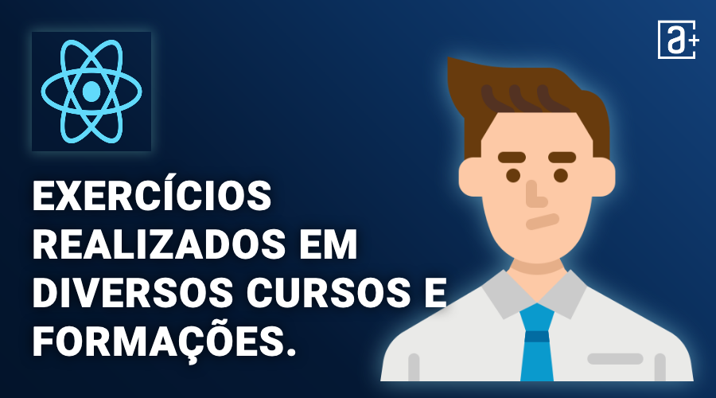

# Cursos Alura

Repositório de exercícios realizados em aulas de diversos cursos e formações na Alura.

## 📚 Cursos

Curso
 | Carga Horária | Atividades | 
Finalizado
 | Certificado
------------ | ------------- | ------------- | ------------- | -------------
Design Patterns em PHP: padrões comportamentais | 
8 horas
 | 
60
 | 26/02/2022
Design Patterns em PHP: padrões estruturais | 
8 horas
 | 
60
 | 28/02/2022
Design Patterns em PHP: padrões criacionais | 
8 horas
 | 
60
 | 01/03/2022 |
PHP e Clean Architecture: descomplicando arquitetura de software | 
8 horas
 | 
60
 | 04/03/2022 |
PHP e Domain Driven Design: apresentando os conceitos | 
8 horas
 | 
60
 | 04/03/2022 |
PHP Composer: Dependências, Autoload e Publicação | 
6 horas
 | 
60
 | 24/03/2022 |
PHP e MySQL: Criando uma webapp | 
10 horas
 | 
60
 | 24/03/2022 |
PHP e PDO: trabalhando com bancos de dados | 
10 horas
 | 
60
 | 26/03/2022 |
MVC com PHP: entenda o padrão Model-View-Controller | 
14 horas
 | 
60
 | 09/04/2022 |
Laravel: criando uma aplicação com MVC | 
8 horas
 | 
60
 | 01/09/2022 |
Laravel: validando formulários, usando sessões e definindo relacionamentos | 
8 horas
 | 
60
 | 13/09/2022 |
Laravel: transações, service container e autenticação | 
8 horas
 | 
60
 | 14/09/2022 |
Laravel: e-mails, eventos assíncronos, uploads e testes | 
8 horas
 | 
60
 | 16/09/2022 |
Laravel: construindo APIs | 
8 horas
 | 
60
 | 20/09/2022 |
Java JRE e JDK: compile e execute o seu programa | 
8 horas
 | 
60
 | 21/12/2022 |
Java OO: entendendo a Orientação a Objetos | 
8 horas
 | 
60
 | 22/12/2022 |
Java Polimorfismo: entenda herança e interfaces | 
16 horas
 | 
60
 | 22/12/2022 |
Java Exceções: aprenda a criar, lançar e controlar exceções | 
8 horas
 | 
60
 | 22/12/2022 |
Java e java.lang: programe com a classe Object e String | 
12 horas
 | 
60
 | 23/12/2022 |
Java e java.util: Coleções, Wrappers e Lambda expressions | 
12 horas
 | 
60
 | 24/12/2022 |
Java e java.io: Streams, Reader e Writers | 
12 horas
 | 
60
 | 31/12/2022 |
Java Collections: Dominando Listas, Sets e Mapas | 
20 horas
 | 
60
 | 16/03/2023 |
Java 8: conheça as novidades dessa versão | 
12 horas
 | 
60
 | 16/03/2023 |
TDD e Java: testes automatizados com JUnit | 
8 horas
 | 
60
 | 17/03/2023 |
PHP: conceitos, lidando com dados, loops e mais | 
6 horas
 | 
60
 | 23/02/2022 |
Avançando com PHP: Arrays, Strings, Função e Web | 
8 horas
 | 
60
 | 23/02/2022 |
Orientação a Objetos com PHP: Classes, métodos e atributos | 
8 horas
 | 
60
 | 26/02/2022 |
Avançando com Orientação a Objetos com PHP: Herança, Polimorfismo e Interfaces | 
10 horas
 | 
60
 | 26/02/2022 |
PHP: manipulando coleções com Arrays | 
8 horas
 | 
60
 | 12/03/2022 |
PHP Strings: manipulando textos com PHP | 
8 horas
 | 
60
 | 30/08/2022 |
PHP I/O: trabalhando com arquivos e streams | 
10 horas
 | 
60
 | 23/03/2022 |
PHP Exceptions: tratamento de erros | 
8 horas
 | 
60
 | 23/03/2022 |
Quality Assurance: plano de testes e gestão de bugs | 
8 horas
 | 
60
 | 07/04/2023 |
Microsserviços: padrões de projeto | 
6 horas
 | 
60
 | 01/04/2023 |
Microsserviços: explorando os conceitos | 
8 horas
 | 
60
 | 01/04/2023 |
Microsserviços na prática: entendendo a tomada de decisões | 
8 horas
 | 
60
 | 01/04/2023 |
Integração Contínua: mais qualidade e menos risco no desenvolvimento | 
6 horas
 | 
60
 | 02/04/2023 |
Entrega Contínua: confiabilidade e qualidade na implantação de software | 
8 horas
 | 
60
 | 02/04/2023 |
Scrum: agilidade em seu projeto | 
10 horas
 | 
60
 | 04/04/2023 |
Organização de Equipes Ágeis: os papéis existentes em uma equipe | 
6 horas
 | 
60
 | 05/04/2023 |
Extreme Programming: metodologia de desenvolvimento ágil de software | 
8 horas
 | 
60
 | 06/04/2023 |
SOLID com PHP: princípios da programação orientada a objetos | 
6 horas
 | 
60
 | 26/02/2022 |
Object Calisthenics: exercitando a Orientação a Objetos | 
6 horas
 | 
60
 | 27/02/2022 |
Refatoração em PHP: boas práticas no seu código | 
8 horas
 | 
60
 | 23/08/2022 |
XDebug: ferramenta de debug e profiling | 
8 horas
 | 
60
 | 23/08/2022 |
PHP e TDD: testes com PHPUnit | 
6 horas
 | 
60
 | 26/08/2021 |
Mocks em PHP: entenda os dublês de testes | 
10 horas
 | 
60
 | 27/02/2022 |
Testes de integração com PHP: testando o acesso à API e ao banco de dados | 
8 horas
 | 
60
 | 02/03/2022 |
PHP e Behavior Driven Development: BDD com Behat | 
8 horas
 | 
60
 | 03/03/2022 |
CSS: Flexbox e layouts responsivos | 
6 horas
 | 
60
 | 30/03/2023 |
CSS: construindo layouts com Grid | 
6 horas
 | 
60
 | 31/03/2023 |
SASS: CSS sintaticamente espetacular | 
8 horas
 | 
60
 | 31/03/2023 |
Tailwind CSS: estilizando a sua página com classes utilitárias | 
8 horas
 | 
60
 | 31/03/2023 |
Praticando CSS: Grid e Flexbox | 
6 horas
 | 
60
 | 31/03/2023 |
React: escrevendo com Typescript | 
12 horas
 | 
60
 | 21/03/2023 |
React: lidando com arquivos estáticos | 
10 horas
 | 
60
 | 23/03/2023 |
React: conhecendo a biblioteca React Router | 
10 horas
 | 
60
 | 24/03/2023 |
React: integrando seu projeto React com APIs | 
8 horas
 | 
60
 | 24/03/2023 |
HTTP: Entendendo a web por baixo dos panos | 
14 horas
 | 
60
 | 04/05/2022 |
React: gerenciando estado com Recoil | 
8 horas
 | 
60
 | 24/09/2022 |
React: testando os seus componentes | 
10 horas
 | 
60
 | 21/03/2023 |
React: otimizando a performance | 
8 horas
 | 
60
 | 25/03/2023 |
TypeScript parte 1: evoluindo seu JavaScript | 
10 horas
 | 
60
 | 06/05/2022 |
TypeScript parte 2: avançando na linguagem | 
10 horas
 | 
60
 | 07/05/2022 |
Typescript parte 3: mais técnicas e boas práticas | 
10 horas
 | 
60
 | 14/05/2022 |
Vue3: explorando o framework | 
8 horas
 | 
60
 | 25/03/2023 |
Vue3: avançando no framework | 
8 horas
 | 
60
 | 26/03/2023 |
Vue3: composition API e Vuex | 
8 horas
 | 
60
 | 26/03/2023 |
Integração Contínua: testes automatizados e pipeline no Github Actions | 
6 horas
 | 
60
 | 09/04/2023 |
Integração Contínua: Pipeline Docker no Github Actions | 
8 horas
 | 
60
 | 09/04/2023 |
Integração Contínua: Pipeline de entrega e implementação contínua na EC2 | 
8 horas
 | 
60
 | 12/04/2023 |
Integração Contínua: automatize o deploy no Amazon ECS | 
8 horas
 | 
60
 | 12/04/2023 |
Integração Contínua: Rollback e teste de carga | 
8 horas
 | 
60
 | 12/04/2023 |
Integração Contínua: automatizando a entrega no Kubernetes | 
8 horas
 | 
60
 | 13/04/2023 |
Infraestrutura como código: preparando máquinas na AWS com Ansible e Terraform | 
8 horas
 | 
60
 | 08/04/2023 |
Docker: criando e gerenciando containers | 
10 horas
 | 
60
 | 08/04/2023 |
Integração Contínua: testes automatizados e pipeline no Github Actions | 
6 horas
 | 
60
 | 09/04/2023 |
Integração Contínua: Pipeline Docker no Github Actions | 
8 horas
 | 
60
 | 09/04/2023 |
Observabilidade: coletando métricas de uma aplicação com Prometheus | 
10 horas
 | 
60
 | 11/04/2023 |
Monitoramento: Prometheus, Grafana e Alertmanager | 
12 horas
 | 
60
 | 11/04/2023 |
Arquitetura de computadores: por trás de como seu programa funciona | 
8 horas
 | 
60
 | 07/04/2023 |
Windows Prompt: utilizando o CMD | 
8 horas
 | 
60
 | 07/04/2023 |
Linux Onboarding: usando a CLI de uma forma rápida e prática | 
8 horas
 | 
60
 | 07/04/2023 |
Linux Onboarding: localizando arquivos e conteúdos | 
8 horas
 | 
60
 | 08/04/2023 |
Git e GitHub: repositório, commit e versões | 
8 horas
 | 
60
 | 08/04/2023 |
Redes onboarding: uma perspectiva prática | 
8 horas
 | 
60
 | 08/04/2023 |
Shell Scripting parte 1: scripts de automação de tarefas | 
8 horas
 | 
60
 | 13/04/2023 |
Shell Scripting parte 2: fazendo monitoramento, agendando tarefas e backup | 
8 horas
 | 
60
 | 13/04/2023 |
JavaScript e HTML: desenvolva um jogo e pratique lógica de programação | 
16 horas
 | 
60
 | 23/02/2022 |
JavaScript e HTML: pratique lógica com desenhos, animações e um jogo | 
10 horas
 | 
60
 | 23/02/2022 |
Doctrine ORM: acesse o banco com Mapeamento Objeto-Relacional | 
10 horas
 | 
60
 | 31/03/2022 |
Laravel parte 1: produtividade no desenvolvimento web | 
6 horas
 | 
60
 | 12/04/2022 |
Laravel parte 2: trabalhando com Autenticação, Relacionamentos e Testes | 
10 horas
 | 
60
 | 12/04/2022 |
Lumen: API Rest com o Micro-framework do Laravel | 
10 horas
 | 
60
 | 01/05/2022 |
PHP Strings: Operações e expressões regulares | 
8 horas
 | 
60
 | 23/03/2022 |
PHP Refatoração: boas práticas no seu código | 
6 horas
 | 
60
 | 13/04/2023 |
Laravel parte 3: Eventos, filas, upload e e-mail | 
10 horas
 | 
60
 | 30/04/2022 |
PHP: dominando as Collections | 
8 horas
 | 
60
 | 13/04/2023 |
Doctrine: conhecendo um ORM PHP | 
8 horas
 | 
60
 | 31/08/2022 |
JavaScript: conhecendo o Browser e padrões de projeto | 
12 horas
 | 
60
 | 25/09/2022 |
JavaScript: aprofundando em MVC, padrão Proxy e Factory | 
12 horas
 | 
60
 | 28/03/2023 |
Expressões regulares: capturando textos de forma mágica | 
12 horas
 | 
60
 | 13/04/2023 |
JavaScript: programando na linguagem da web | 
20 horas
 | 
60
 | 23/09/2022 |
HTML5 e CSS3 parte 4: avançando no CSS | 
8 horas
 | 
60
 | 09/04/2022 |
Docker: Criando containers sem dor de cabeça | 
10 horas
 | 
60
 | 04/02/2022 |
SQL com MySQL: manipule e consulte dados | 
12 horas
 | 
60
 | 31/08/2022 |
Data Visualization: técnicas de visualização com Google Sheets | 
8 horas
 | 
60
 | 14/04/2023 |

Conteúdos complementares:

    Hipsters: Práticas de Orientação a Objetos – Hipsters #129 - 56min
    Alura+: Design de código vs Arquitetura de software - 7min
    Alura+: Clean Architecture (Arquitetura Limpa - O que é? - 11min
    Artigo: Modelagem OO > Linguagem OO - 30min
    Hipsters: PHP não é coisa de sobrinho! – Hipsters #36 - 47min
    Alura+: Novidades do PHP 7.4 - Typed Properties - 6min
    Alura+: Novidades do PHP 7.4 - Arrow Functions - 5min
    Alura+: Como lidar com senhas no PHP - 8min
    Alura+: ORM: O que é? - 4min
    Alura+: O que é REST? - 14min
    Artigo: Boas práticas de desenvolvimento PHP | Alura Cursos Online - 30min
    Alura+: O que são Enums no Java? - 17min
    Alura+: O que são Anotações no Java? - 23min
    Alura+: Novidades do Java 9 e para frente - 9min
    Site: 7days Of Code | Alura - 0min
    Alura+: Trabalhando com Multibyte String em PHP - 6min
    Alura+: Upload de arquivos com PHP - 8min
    Artigo: POO: o que é programação orientada a objetos? | Alura Cursos Online - 30min
    Podcast: Práticas de Orientação a Objetos - Hipsters #129 - Hipsters Ponto TechHipsters Ponto Tech - 60min
    Artigo: Trabalhando com arrays em PHP | Alura Cursos Online - 30min
    Alura+: Design de código vs Arquitetura de software - 7min
    Alura+: O que é arquitetura hexagonal? - 11min
    Alura+: Clean Architecture (Arquitetura Limpa - O que é? - 11min
    Alura+: Domain-Driven Design (DDD - O que é? - 13min
    Alura+: O que é Mensageria? - 11min
    Alura+: Modelagem de eventos - 11min
    Alura+: O que é uma arquitetura orientada a eventos? - 11min
    Hipsters: Testes Automatizados – Hipsters #51 - 46min
    Alura+: O que é Test-Driven Development (TDD? - 16min
    Alura+: O que é Behavior-Driven Development (BDD? - 11min
    Alura+: Entenda a Pirâmide de Teste - 16min
    Alura+: API: Testes de contrato - 20min
    Alura+: Cobertura de Código - 9min
    Alura+: Testes de Mutação - Testando seus testes - 12min
    Alura+: O que é uma API? - 8min
    Alura+: Boas práticas na Modelagem de API's REST - 15min
    Alura+: O que é REST? - 14min
    Alura+: O que são Microsserviços? - 16min
    Alura+: Tipos de Microservices - 6min
    Hipsters: Monolitos – Hipsters #173 - 48min
    Hipsters: Microserviços – Hipsters #17 - 44min
    Alura+: O que é um API Gateway? - 10min
    Alura+: O que é Service Mesh? - 8min
    Alura+: O que é DevOps? - 11min
    Hipsters: Primeiros passos com Devops – Hipsters #81 - 52min
    Alura+: O que é DevSecOps? - 16min
    Hipsters: DevOps: Observabilidade – Hipsters Ponto Tech #260 - 53min
    Alura+: SRE - Engenharia de Confiabilidade de Sites - 15min
    Hipsters: SRE: Site Reliability Engineering – Hipsters #187 - 51min
    Alura+: O que é Observabilidade? - 18min
    Alura+: Monitorando aplicações: 4 Golden Signals - 10min
    Alura+: Monitoramento com Netdata - 14min
    Hipsters: Monitoramento: não receba mais telefonemas de madrugada! – Hipsters #12 - 46min
    Alura+: O que são Containers? - 14min
    Alura+: O que é Serverless? - 26min
    Alura+: O que é Infraestrutura como Código (IaC? - 13min
    Hipsters: Agilidade – Hipsters #05 - 47min
    Alura+: Cascata vs Ágil - 14min
    Hipsters: Kanban e o fluxo de trabalho – Hipsters #74 - 55min
    Alura+: Scrum x Kanban - 10min
    Alura+: O que é eXtreme Programming? - 7min
    Artigo: REST: Conceito e fundamentos - 30min
    Artigo: Microsserviços com .NET Core: Comunicação Entre Serviços - 30min
    Artigo: Devops: o que é e principais práticas - 30min
    Artigo: Kanban: o que é e como funciona - 30min
    Alura+: Trabalhando com Multibyte String em PHP - 6min
    Alura+: Mitos sobre PHP - 10min
    Alura+: Período entre datas em PHP - 5min
    Artigo: Quando usar == ou === em php? - Blog da Alura - 30min
    Artigo: Manipulando datas e horários com PHP - Blog da Alura - 30min
    Hipsters: SOLID: Código bom e bonito – Hipsters Ponto Tech #219 - 55min
    Hipsters: Práticas de Orientação a Objetos – Hipsters #129 - 56min
    Alura+: Tell, don't ask e Fail Fast - 7min
    Alura+: Entenda a Pirâmide de Teste - 16min
    Hipsters: Testes Automatizados – Hipsters #51 - 46min
    Alura+: Testes de Mutação - Testando seus testes - 12min
    Artigo: Configurando o Xdebug em editores da Jetbrains | Alura Cursos Online - 30min
    Alura+: CSS FlexBox: distribua elementos de forma responsiva - 29min
    Artigo: Flexbox CSS: guia completo, elementos e exemplos | Alura - 30min
    Artigo: CSS Object-fit: trabalhando com proporções | Alura - 30min
    Alura+: Ciclo de vida de um componente React - 11min
    Alura+: Hooks do React: useCallback - 17min
    Artigo: React Hooks: o que é e como eles funcionam | Alura Cursos Online - 30min
    Artigo: NPM vs Yarn | Alura Cursos Online - 30min
    Artigo: React: componentes com Styled Components | Alura Cursos Online - 30min
    Artigo: REST: Conceito e fundamentos - 30min
    Artigo: Prop Drilling: o que é? | Alura Cursos Online - 30min
    Site: 7 days Of Code | Alura - 0min
    Artigo: Javascript ou Typescript? | Alura Cursos Online - 30min
    Alura+: Preparando o ambiente com Vue! - 22min
    Artigo: Angular vs React vs Vue.js | Alura Cursos Online - 30min
    Artigo: Vue 3: Conhecendo mais de perto | Alura Cursos Online - 30min
    Podcast: Vue.js - Hipsters Ponto Tech #288 - Hipsters Ponto TechHipsters Ponto Tech - 60min
    Artigo: Mockando APIs REST com json-server | Alura Cursos Online - 30min
    Alura+: Ciclo de vida de um componente React - 11min
    Artigo: React Hooks: o que é e como eles funcionam | Alura Cursos Online - 30min
    Artigo: NPM vs Yarn | Alura Cursos Online - 30min
    Artigo: React: componentes com Styled Components | Alura Cursos Online - 30min
    Artigo: REST: Conceito e fundamentos - 30min
    Artigo: Prop Drilling: o que é? | Alura Cursos Online - 30min
    Site: 7days Of Code | Alura - 0min
    Video: Pipeline (CD/CI // Dicionário do Programador - YouTube - 60min
    Video: Kubernetes // Dicionário do Programador - YouTube - 60min
    Alura+: O que é Infraestrutura como Código (IaC? - 13min
    Hipsters: Containers e Docker – Hipsters #75 - 50min
    Hipsters: Integração Contínua, Deploy Contínuo e Github Actions – Hipsters #213 - 47min
    Alura+: O que é Observabilidade? - 18min
    Hipsters: Histórias de Black Friday 4 – Hipsters Ponto Tech #280 - 50min
    Artigo: O que é o Docker e quais as Vantagens de usá-lo? | Alura - 30min
    Alura+: O que é DevOps? - 11min
    Alura+: Shift Left em DevOps - 15min
    Alura+: Git Flow versus Trunk-based development - 12min
    Alura+: O que é Infraestrutura como Código (IaC? - 13min
    Alura+: O que é DevSecOps? - 16min
    Alura+: O que é Observabilidade? - 18min
    Alura+: O que são Containers? - 14min
    Alura+: O que é Serverless? - 26min
    Alura+: SRE - Engenharia de Confiabilidade de Sites - 15min
    Alura+: Windows Subsystem for Linux (WSL - 12min
    Alura+: Praticando Lógica de Programação com Shell Scripting - 19min
    Video: O que você precisa saber para começar em DevOps com Leonardo Sartorello | #HipstersPontoTube - YouTube - 60min
    Artigo: Cloud: o que é, História e Guia da computação em nuvem | Alura - 30min
    Artigo: O que são Feature Flags ou Feature Toggles? - 30min
    Artigo: O que é TCP, UDP e quais as diferenças? - 30min
