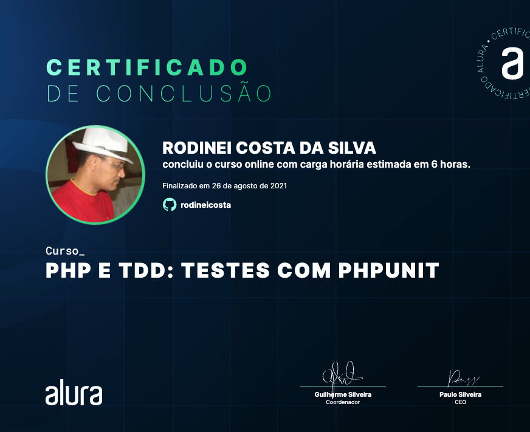

# PHP e TDD: testes com PHPUnit

Categoria | Atividades | Carga horária | Finalizado | Certificado |
:-:|:-:|:-:|:-:|:-:|
Programação | 56 | 6 horas | 26/08/2021 | [Certificado Normal](https://cursos.alura.com.br/certificate/ccc24e4c-0d32-4c10-9852-8bd2c256b1f5) / [Certificado Formal](https://cursos.alura.com.br/user/rodineicosta/course/phpunit-tdd/formalCertificate)

## Aulas

- Por que testar?
- Conhecendo o PHPUnit
- Classes de equivalência
- Organizando os testes
- Test Driven Development
- Testando exceções
